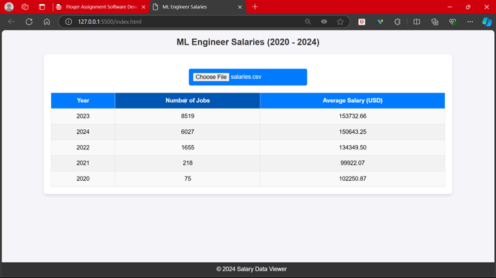

# Salary Trends Dashboard

This **Salary Trends Dashboard** web application is built using **HTML** and **JavaScript**. It provides users with a visual representation of salary trends over the years, allowing for insights into job title distributions, salary ranges, and more.

## Features

- **Clickable Table Rows**: Clicking on a specific year in the main table opens up a secondary table that shows job titles and the number of jobs for that year.
- **Aggregated Data**: Provides a summary of job titles and salary information for each year.

## Demo

> _This is a screenshot of the Salary Trends Dashboard displaying job salaries for various roles over the years._

Make sure you replace the file path (`./images/dashboard_screenshot.png`) with the correct path to your image file. If you don't have an image directory yet, create a folder called `images` and place your screenshot there.

## Technologies Used

- **HTML5**: For structuring the web page content.
- **CSS**: For styling the dashboard and making it visually appealing.
- **JavaScript**: For data processing, interactivity, and DOM manipulation.

